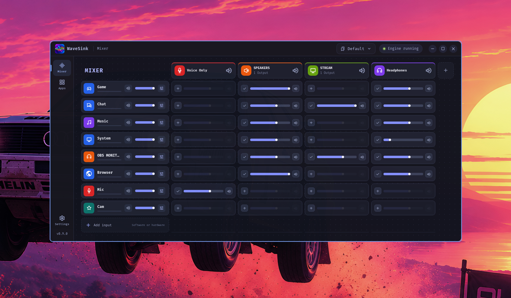
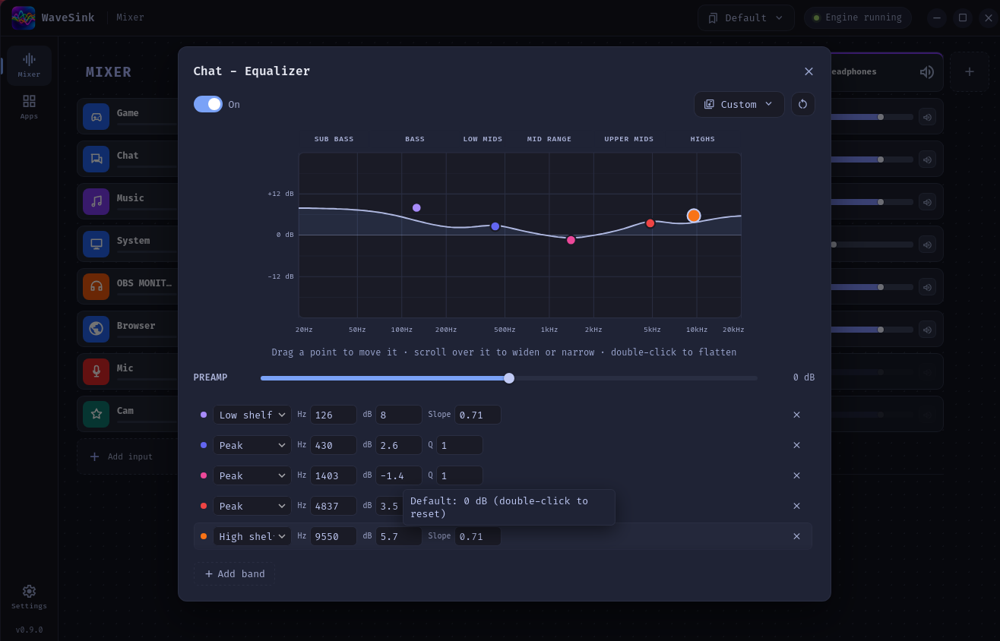
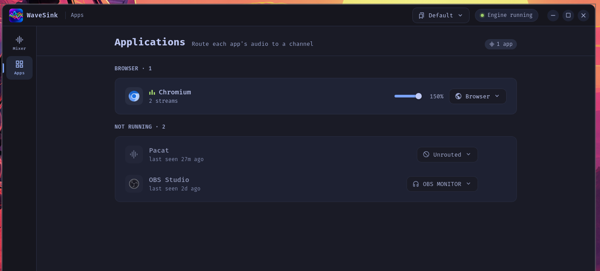

<p align="center">
  
</p>

# WaveSink

Linux-native input/mix routing for PipeWire, inspired by the workflow of
modern creator mixers.

Group unlimited apps into software inputs such as Game, Chat, and Music;
then build independent Personal, Stream, Chat, and custom mixes for
monitoring and capture. Hardware inputs join the same matrix with independent
routing, levels, and visual identity.



```
 inputs ──► independent route cells ──► Personal / Stream / Chat mixes
                                               ├──► headphones / speakers
                                               └──► WaveSink: <mix> for OBS/Discord
```

## Features

- **Inputs and mixes** - software channels group unlimited apps under one
  source fader; mixes are independent destinations with per-cell send,
  mute, and master controls
- **Apps** - running apps appear automatically; assign once, remembered
  forever
- **Mixes** - recordable sources for OBS. Master Mix carries everything;
  custom mixes can carry "everything except music" and stay current as
  channels change. A mix can also carry your processed microphone, so one
  input device holds your voice plus app audio (Sonar-style Stream Mix),
  and each member gets its own send level and mute inside the mix - what
  recorders hear, independent of your own volume (pop out a mix's levels
  from its strip). In OBS, add a mix as an audio input - not Desktop Audio. A mix can also
  sit with the output devices instead, if you would rather keep your
  recording list short; it stays capturable through its monitor.
- **Independent destinations** - Personal, Stream, Chat, and custom mixes
  keep separate balances. Monitor selection changes what you hear without
  rewriting app assignments; every mix is capturable as `WaveSink: <name>`.
- **Equalizer** - per-input parametric EQ (up to 10 bands) with a
  draggable response curve, bundled community presets, and import/export
  including AutoEq text blocks
- **Hardware inputs** - add physical sources to the matrix, then route each
  independently to any mix. Audio FX settings are saved per input.
- **Profiles** - save and switch full layouts from the tray
- **Themes** - Original, Tokyo Night, Gruvbox Dark, or the active Omarchy
  palette. New Omarchy installs default to its live desktop palette; existing
  selections and the built-in themes remain available everywhere.




## Install

Grab the latest from [WaveSink Releases](https://github.com/calmasacow/WaveSink/releases)
and install the file directly. WaveSink does not currently publish to AUR or
COPR.

**Fedora / openSUSE**

```bash
sudo dnf install ./wavesink-*.x86_64.rpm
```

**Debian / Ubuntu / Mint**

```bash
sudo apt install ./wavesink_*_amd64.deb
```

**Arch / Manjaro / EndeavourOS**

```bash
sudo pacman -U ./wavesink-bin-*-x86_64.pkg.tar.zst
```

These install the app properly - launcher entry, icon, uninstall
through your package manager.

**Any other distro - AppImage (portable, no root)**

```bash
chmod +x wavesink_*_amd64.AppImage
./wavesink_*_amd64.AppImage
```

To get a launcher entry for an AppImage, use
[Gear Lever](https://flathub.org/apps/it.mijorus.gearlever) or
AppImageLauncher.

Requires PipeWire with `pipewire-pulse` and WirePlumber 0.5+ (the default
on most current distros).

## Build

```bash
npm install
npm run tauri dev      # run
npm run tauri build    # package
```

Config lives in `~/.config/wavesink` as plain JSON. Existing `~/.config/sink`
state moves there automatically on first launch.

The routing contract is documented in [docs/routing-model.md](docs/routing-model.md).
On first launch after upgrading, old JSON files are backed up beside the new
`routing.json`; see the migration notes there for the Sonar/old-sink mapping.

For the current implementation status and an OpenCode-ready continuation plan,
see [OPENCODE_HANDOFF.md](OPENCODE_HANDOFF.md).

## Contact

If you need help or run into something broken, the discord is the fastest
way to reach me.

[](https://discord.gg/jUMuSxGf6q)

## License

[GPL-3.0](LICENSE)
